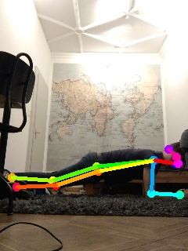
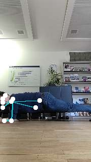
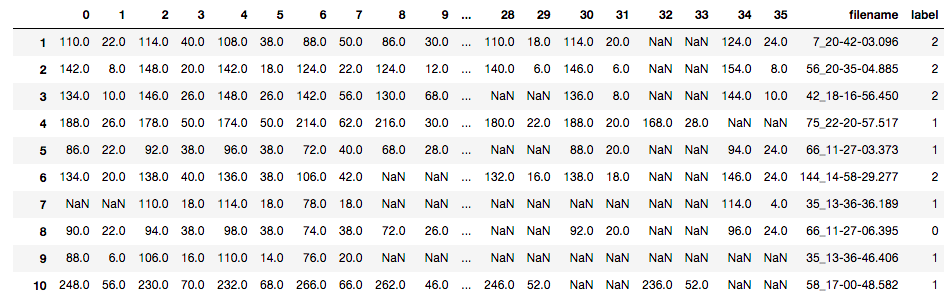
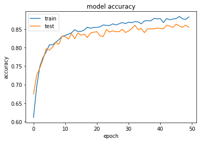
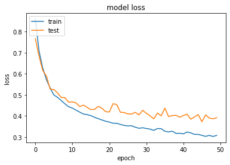
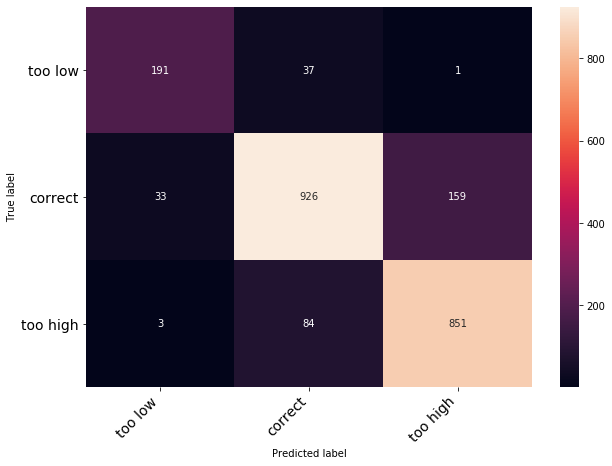

# Correcting Wrong Posture on the Plank Fitness Exercise using a Neural Network with Keras

## Get Started

To run the training of the artificial neural network, run the ANN.ipynb with jupyter notebook. All necessary requirements are in the requirements.txt which can be installed by running `pip install -r requirements.txt`.

## Overview
This repository is created during the Neural Networks and Deep Learning course at the University of Zürich.
The goal is to detect wrong posture from the plank fitness exercise using outputs from human keypoint detection.
The use case of this project is an AI fitness coach that can detect wrong posture during a workout by just using a smartphone.
We used Keras for training the ANN.

The following picture shows the keypoint detection during a plank. In this case, it would be easy to detect whether the hips are too high by calculating the angle between the shoulder, hips and feet.

However, often the detection is incomplete or erroneous: 

In this case, we would need to add another rule to detect whether the back position is correct or not. This is time-consuming and prone to errors, since there are many possibilities of badly detected keypoints. Fortunately, thanks to our collected dataset and the power of neural networks this problem belong to the past!

We trained an artificial neural network to detect whether the position of the back was **too low**, **correct** or **too high**, even if not all keypoints were detected.

## Dataset

In order to collect the ground-truth, we labeled 8'000 pictures of people doing planks. The images were labeled by freelancers on the outsourcing platform upwork and created from Beta users of the fitness app VAY Sports (www.vay-sports.com). The original images were removed to protect the privacy of the users. Labeling costs were 100$.
VGG image annotator was used to label relevant keypoints:

As a next step, we calculated the angle of the back from these keypoints. If the angle is between 178 and 190 degrees the position was correct (label 1), else too low (label 0) or too high (label 2). These thresholds were set by consulting a professional fitness coach.
We then added the correct labels to the original data to create the dataset that we trained on. This is a snapshot of our dataset:

As you can see, many keypoints were not detected (depicted as NaNs), which makes a rule-based mistake detection difficult as already explained above.

## Pre-Processing

Unfortunately, the data with the keypoints (= position of limbs such as shoulders, hips etc) were not in a table format but in a text format and had to be pre-processed as follows:
1. Get only relevant keypoints: On many images, no one was training. So first, an algorithm had to be created which extracted all the images and accompanying keypoints text files, where a person was actually training (files: getStateExercising.py, removeStateNoneImages.py)
2. Convert these textfiles containing keypoints into a dataframe that can be processed. (files: removeFirstLineOfTextFile.py, txtToDataFrame.py)
3. Convert labeled images into a dataframe. (file: labelsToDataFrame.py)
4. Calculate actual labels from labeled images by calculating the angle of the hips (file: calculateAngle.py)
5. Combine labels from 3. to dataframe from 1. to the final training dataset (file: combineDataSets.py)
6. Standardize, Remove NaN's and split into train and testset (included in ANN.ipynb)

We even did data augmentation to increase the size of the data set by flipping and scaling the keypoints (file: flipScaleKeypoints.ipynb) Unfortunately, time was too restricted to implement it into the training dataset.

## Architecture

After testing many combinations, the following architecture yielded the best results (for the whole model have a look at ANN.ipynb): 

**Inputs:** 
36 features (18 keypoints with their x and y values)

**4 fully connected layers:**
1. layer: 36 neurons, activation: relu
2. layer: 18 neurons, activation: relu
3. layer: 9 neurons, activation: relu
4. layer: 3 output neurons, activation: Softmax (Softmax makes sure, that the outputs get transformed to probabilities)

(We called it the flipped pyramid :P )

**Loss function:**
Categorical crossentropy (since we're delaing with multi label outputs)

**Optimizer:** 
Adam

We also implemented batch-normalization and tested the network with up to 512 neurons per layer, however the results didn't improve. (batch norm implementation and crossvalidation can be found in ANN_crossvalidated.ipynb)

## Results

The network yielded a 5-fold cross-validation test set accuracy of 86 %, which beat the previous rule-based algorithm by around 6%!

Even better: After looking at some predictions, the real accuracy is probably much higher, since many pictures are edge cases (e.g. where the angle was only 0.1 degree too high for a correct prediction) and therefore the predictions would still make sense.

The following accuracy and loss plots show that the ANN learned very well already after only 20 epochs.

The confusion matrix shows, that too low mistakes were detected very well and that the network had difficulties differentiating between too high and correct.

Training time was very low and can be run in under 2 minutes on a standard CPU.

## Future improvements

As already mentioned, wrong posture is often on a continuous scale. Therefore, instead of having discrete labels as outputs, the 
neural network could be trained to predict a continuous output, which shows the magnitude of wrong posture.

Furthermore, the data is a time series. Therefore, a recurrent neural network such as an Long-Short-Term Memory Network could be trained such that
past data flows into the prediction of the current frame. This would most-likely increase the accuracy.

Of course, the network can be adapted to other fitness exercises as well. Plank is a relatively easy case, since it is a static exercise. 
Other exercises that include repetitions, such as pushups or squats, will be more challenging and need a more sophisticated approach.

## Project Plan

**1. Convert predicted keypoints from old algorithm (as txt files) to a Pandas DataFrame:**
- Rows (8'000): Picture names (e.g. 3_12-22-09.655)
- Columns (36): Keypoints in x and y as follows: 0x, 0y, 1x, 1y, ... , 17x, 17y

**2. Convert labeled keypoints to a Pandas DataFrame:**
- Rows (8'000): Picture names (e.g. 3_12-22-09.655)
- Columns (6): Keypoints in x and y as follows: 0, 1, 2, 3, 4, 5, 6

**3. Calculate and add labels "correct", "tooHigh", "tooLow" to the labeled DataFrame as an additional column, by calculating the angle of the back.**
The angle of the back can be calculated by using keypoints 2 (shoulders), 3 (hips), 4 (knees). If the angle is lower than 178 degrees, label is too low (0),
if the angle is over 190 degrees, label is tooHigh (2), else label is correct (1).

**4. Add the created label column to the Pandas DataFrame from 1. Now each predicted picture has the correct ground-truth to it.**

**5. Create an Artificial Neural Network in Keras to train on this DataFrame.**
